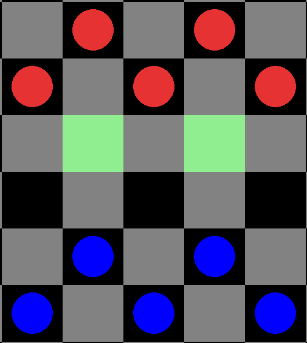
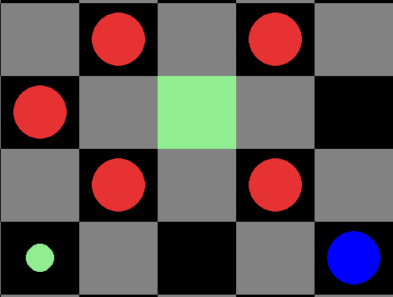
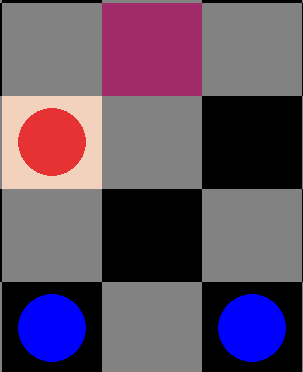
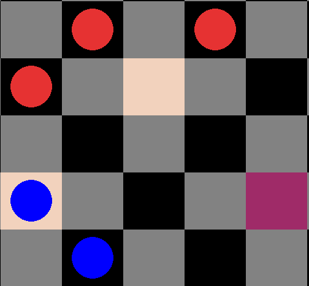

# PolishCheckers
A International Checkers (Polish version)  game written in Python, Pygame.

AI is using minimax algorithm with alpha-beta pruning.

Project built as Python and OOP practice.

To play game on your computer, you can download './executable' folder and run file './executable/main.exe'

# General features

### Sample gameplay

https://github.com/draxnor/PolishCheckers/assets/28366625/2edd9a2f-7c8b-4443-92c7-b021e07130b1

## Game rules

Game follows the rules included in:
https://en.wikipedia.org/wiki/International_draughts

### Game objective:

The objective of the game is to capture all the pieces of the enemy or make enemy player unable to perform any move.

### Victory conditions:
- Enemy player is unable to perform any valid move due to lack of pieces or due to his pieces being blocked by other pieces.

### Draw conditions:
- The same position repeats itself for the third time (not necessarily consecutive), with the same player having the move each time.
- During 25 consecutive moves, there were only king movements, without piece movements or jumps.
- When there is only 1 queen vs (1 queen + 2 pieces or queens), each player can play 16 turns till game ends as a draw.
- When there is only 1 queen vs (1 queen + 1 piece/queen), each player can play 5 turns till game ends as a draw.
- After there are only 1 queen vs 1 queen left on the board, there is only 1 last turn possible (not 1 turn per each player) till game ends as a draw.

### Most important gameplay rules:
- Game is played on 10x10 board
- Each player starts with 20 pieces
- If capturing of enemy piece is possible, it is also mandatory
- Pieces can move 1 square forward or jump over enemy pieces forward and backwards.
- Multiple successive jumps (captures) are possible.
- There is an obligation to capture as many enemy pieces as possible in one's turn.
- Queens can move forward and backward any number of squares.
- While jumping over enemy piece queens can land any number of squares behind captured piece and they can continue jumping from that chosen square.
- Piece becomes a queen at the end of player's turn, if it reached the edge of the board and stopped there.
- Pieces do not become queens in the middle of the sequence of consecutive jumps. Read rule above.

For all other details on rules, please visit link attached at the beginning of the section.

## Options
Game options can be set by selecting:
- Main Menu -> Options 

https://github.com/draxnor/PolishCheckers/assets/28366625/dd0affd0-9575-4662-b5f2-ca48303ca0e3

There one can set:
- Starting side
- Game mode
- AI difficulty

### Game modes

Game offers 3 general game modes:
- Human vs Human (default)

https://github.com/draxnor/PolishCheckers/assets/28366625/4c3075f6-20db-4409-bf53-3b4c23acef17

- Human vs AI

https://github.com/draxnor/PolishCheckers/assets/28366625/8220df85-ef27-44e1-b59b-dc1415a43899

- AI vs AI

https://github.com/draxnor/PolishCheckers/assets/28366625/6f5d3afa-aca4-4545-86ed-20fdcd506a11

### Starting player

In the Options screen one can choose the starting side using self-explanatory buttons: *BOTTOM* and *TOP*.

Highlighted button describe currently set starting side.

### AI difficulty

AI difficulty is described by an integer, and it can be checked/changed inside Options screen in *AI DIFFICULTY* field.

Value entered into *AI DIFFICULTY* field is used as a maximum depth for *MINIMAX* algorithm with alpha-beta pruning.

*AI DIFFICULTY* fields are not rendered unless player changes Game Mode so that there is at least 1 AI player.

To change difficulty, you can enter any integer from 0 to 9. 
To confirm changes press *Enter* or *left-click* on app screen.

Note that entering any number higher than 6 will end up in long computing time.

Entering incorrect characters ends up in no changes.
Any number higher than 9 will be trimmed so that first digit will be set as your difficulty level.

# Gameplay

## Controls
- To move a piece, left-click on it and then press its target position.
- To cancel selection, left-click on any point on board or simply select other piece.
- While in-game, you can press ESC to go back to Main Menu
- While in-game, you can press SPACE to restart the game with the same settings
- Press ESC in Main Menu to exit the app
- Press ESC in Options to go back to Main Menu

## In-game features
- Any time in a game you can restart it by clicking SPACE or escape to Main Menu using ESC.
- Selecting piece with left-click starts highlighting all its valid moves. 
If selected piece has no valid moves, it is automatically unselected.
Possible moves are highlighted in following way:
  - First next possible move/jump destination is highlighted as light-green square.
  - All possible subsequent jumps in a sequence (that can be performed in the same turn) are highlighted as light-green dots/circles.

*Red piece selected - 2 destinations possible*

*Blue piece selected - 1 sequence, composed of 2 consecutive jumps possible*

- Starting from second turn, the sequence of moves made by the opponent during the last turn is highlighted in the following way:
  - Previous position of moving piece is highlighted as amaranth (darker pink)
  - All squares, where enemy piece landed between consecutive jumps are highlighted as bright orange.

*Blue turn. Highlighting squares of red piece origin and destination.*

*Red turn. Highlighting square of blue piece origin and all squares that blue piece landed on while performing a sequence of moves.*

